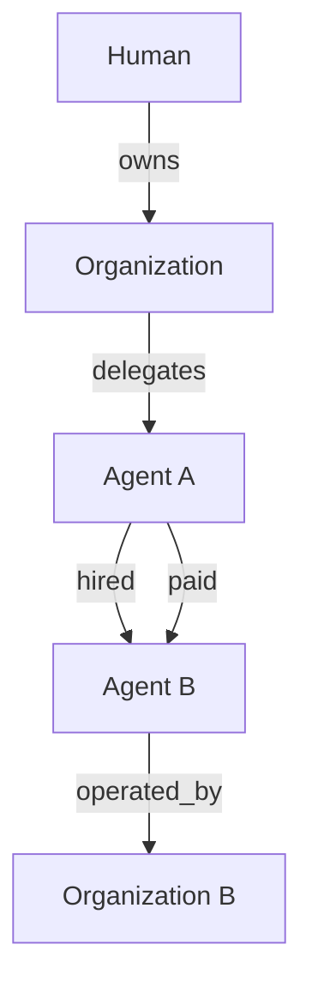

# ALMA v1 — 01: Authority & Trust (Delegation, Credentials, Relationships, Reputation Evidence)

## Delegation model

A `Delegation` is a directed grant of authority: `issuer` → `subject`,
scoped by policy, with a lifecycle independent of the identities it
connects.

```ts
interface Delegation {
  id: string;
  issuerId: string;      // a Principal (Human/Organization) or another Agent
  subjectId: string;     // the Agent receiving authority
  scope: {
    capabilities: string[];       // e.g. ["pay", "swap"]
    policyRefs: string[];         // Policy ids constraining this delegation
  };
  issuedAt: string;
  expiresAt?: string;
  status: "active" | "revoked" | "expired";
  revocation?: { at: string; by: string; reason?: string };
}
```

**Chained delegation** is explicitly modeled: an Agent that itself holds a
Delegation may issue a narrower Delegation to another Agent (e.g., a
treasury agent delegating a bounded sub-budget to a specialist trading
agent), provided the narrower grant is a strict subset of what it holds.
`policy-engine` (`docs/11-policy-model.md`) is responsible for verifying
that a chained delegation doesn't exceed its issuer's own scope — ALMA
defines the shape, the engine enforces the constraint at evaluation time.

## Credential model

A `Credential` is a verifiable claim about a Subject, structured to be
compatible with (though not strictly required to be) a W3C Verifiable
Credential.

```ts
interface Credential {
  id: string;
  subjectId: string;
  type: string;               // "kyb_verified", "token_holding", "dao_membership"
  issuer: string;              // an ALMA identifier, or an external issuer DID/URL
  claim: Record<string, unknown>;
  issuedAt: string;
  expiresAt?: string;
  proof?: { type: string; value: string }; // signature/attestation, format issuer-dependent
  verificationStatus: "unverified" | "verified" | "expired" | "revoked";
}
```

v1 supports **externally-issued** credentials referenced by proof (the
`alma-credentials` package verifies signatures/attestations against known
issuer keys) and **AdaSouls-attested** credentials (e.g., "completed KYB
via AdaSouls's own flow") using the same shape, so a Policy checking
`requiredCredentials` doesn't need to know or care which kind it's looking
at.

## Relationship graph

```text
owns | represents | delegates | operates | member_of | hired | paid | transacted_with
```

Each is a directed, typed edge with a timestamp and, where relevant, a
reference to the `EconomicAction` or `Delegation` that created it (so
`hired`/`paid`/`transacted_with` edges are always traceable back to a
concrete audited event, never asserted without evidence).



This graph is queried, not just stored, for counterparty evaluation
(`docs/11-policy-model.md`) — e.g., "has any agent my organization
operates ever transacted with this counterparty before," which is a graph
traversal, not a single-row lookup.

## Reputation evidence

Per ADR-010, v1 stores evidence, not a score. Evidence rows are
append-only and reference the event that produced them:

```ts
interface ReputationEvidence {
  id: string;
  subjectId: string;          // whose evidence this is
  role: "principal" | "agent"; // kept as separate streams, deliberately
  sourceType: "economic_action" | "marketplace_job" | "dispute";
  sourceId: string;
  outcome: "success" | "failure" | "disputed";
  occurredAt: string;
  detail?: Record<string, unknown>;
}
```

Counterparty policies reference aggregates over this table (completed
count, dispute rate) computed at evaluation time or from a maintained
rollup — never a precomputed opaque score, per ADR-010.

## What's explicitly deferred past v1

A formal, on-chain-anchored attestation registry for Credentials/
Relationships; automated credential issuance pipelines beyond manual/API-
driven attestation; a scoring function over ReputationEvidence
(Phase 16, `docs/20-roadmap.md`).
